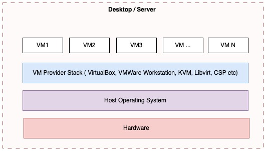

# Lab Setup Prerequisite 

There are several ways to build a Kubernetes cluster. First, we require a couple of Virtual Machines (VMs) or Physical Servers. It's normally feasible to arrange a couple of VMs for this workshop. 

In our desktop/server environment, we can create a VM using several ways:
- [VirtualBox](https://www.virtualbox.org/)
- [VMWare Workstation](https://www.vmware.com/products/desktop-hypervisor/workstation-and-fusion)
- [KVM](https://linux-kvm.org/page/Main_Page) [libvirt](https://libvirt.org/)
- [Vagrant Provisioner](https://www.vagrantup.com)
- VM from cloud provider like [AWS](https://aws.amazon.com/ec2), [Azure](https://azure.microsoft.com/en-us/products/virtual-machines), [GCP](https://cloud.google.com/products/compute?hl=en) or any other providers

VM Specification:
- One VM with 4 Cpu and 4GB RAM
- Two VM with 2 Cpu and 3GB RAM

## VirtualBox

- [Creating a Virtual Machine](https://www.virtualbox.org/manual/topics/Introduction.html#create-vm-wizard)

# References
- https://www.virtualbox.org/
- https://libvirt.org/
- https://linux-kvm.org/page/Main_Page
- https://www.vmware.com/products/desktop-hypervisor/workstation-and-fusion
- https://www.vagrantup.com/